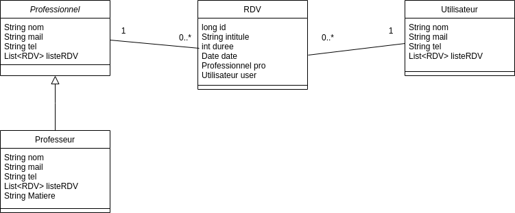

# TP1 et TP2

## Modèle de données

## Partie JPA

### Lancer la partie jpa

Pour lancer la partie JPA, c'est à dire la creation du modèle relationnel et l'insertion de valeurs d'exemples. Il faut executer le fichier JpaTest contenu dans le package jpa.  
Le modèle est dans le package jpa.modele et la dao dans le package dao.

### Requête dao

Toutes les classes étendent AbstractJpaDao qui par défaut donne les méthodes  

    T findOne(final K id);
    List<T> findAll();
    void save(final T entity);
    T update(final T entity);
    void delete(final T entity);
    void deleteById(final K entityId);

Pour la dao professionnel et utilisateur. il y a une requête en plus qui permet de rechercher un professionnel ou un utilisateur par son mail.  
Pour la dao rdv, trois méthodes permettent de retrouver une liste de rdv par le libelle, le mail du professionnel ou le mail de l'utilisateur. La requête "criteriaquery" permet de récuperer la liste des rdv.
## Partie servlet et jaxrs

### Servlet

La servlet UtilisateurInfo est dans le package servlet est permet de créer un nouveau utilisateur et l'affiche par la suite en html.  
Pour lancer la partie servlet, il faut faire Clic droit sur le projet puis run as -> maven build …-> mettre compile jetty:run

### jaxrs

les DTO sont dans le package jaxrs.dto.  
Les services sont dans jaxrs.rest. Ils permettent de visualiser tout les élements d'une classe, d'en afficher un par son id, d'en créer un ou le modifer et de le supprimer.  
ce package contient aussi la classe pour swagger.  
Pour lancer le serveur, il faut executer RestServer dans le package jaxrs.
